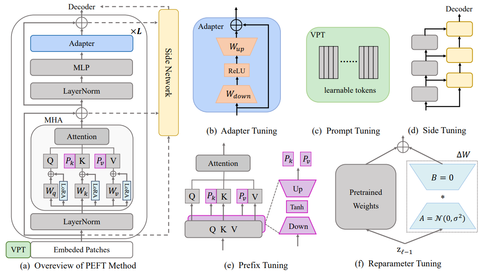

## <p align=center>𝓐𝔀𝓮𝓼𝓸𝓶𝓮 𝓟𝓪𝓻𝓪𝓶𝓮𝓽𝓮𝓻-𝓔𝓯𝓯𝓲𝓬𝓲𝓮𝓷𝓽 𝓣𝓻𝓪𝓷𝓼𝓯𝓮𝓻 𝓛𝓮𝓪𝓻𝓷𝓲𝓷𝓰</p>
<div align=center>

<p>

  
  
  
 

 [](https://github.com/sindresorhus/awesome)
 [](https://GitHub.com/Naereen/StrapDown.js/graphs/commit-activity)
</p>

𝓐 𝓬𝓸𝓵𝓵𝓮𝓬𝓽𝓲𝓸𝓷 𝓸𝓯 𝓻𝓮𝓼𝓸𝓾𝓻𝓬𝓮𝓼 𝓸𝓷 𝓹𝓪𝓻𝓪𝓶𝓮𝓽𝓮𝓻-𝓮𝓯𝓯𝓲𝓬𝓲𝓮𝓷𝓽 𝓽𝓻𝓪𝓷𝓼𝓯𝓮𝓻 𝓵𝓮𝓪𝓻𝓷𝓲𝓷𝓰.

</div>

## ⭐ <span id="head1"> *Citation* </span>

If you find our survey and repository useful for your research, please cite it below:

```bibtex

@article{xin2024parameter,
  title={Parameter-Efficient Fine-Tuning for Pre-Trained Vision Models: A Survey},
  author={Xin, Yi and Luo, Siqi and Zhou, Haodi and Du, Junlong and Liu, Xiaohong and Fan, Yue and Li, Qing and Du, Yuntao},
  journal={arXiv preprint arXiv:2402.02242},
  year={2024}
}

```

## 🔥 <span id="head1"> *News* </span>
* [2024/03/01] "**Visual PEFT Library/Benchmark**" repo is created.

* [2024/02/01] "**Parameter-Efficient Fine-Tuning for Pre-Trained Vision Models: A Survey**" is released.
  
* [2023/01/01] "**Awesome-Parameter-Efficient-Transfer-Learning**" repo is created.

## 📚 <span id="head1"> *Table of Contents* </span>
- [Introduction](#introduction)

- [Keywords](#keywords)

- [Papers](#papers)

  - [Addition-based Tuning](#addition-based-tuning)
    - [Adapter Tuning](#adapter-tuning)&emsp;&emsp;&nbsp;
  
    - [Prompt Tuning](#prompt-tuning)&emsp;&emsp;&nbsp;
  
    - [Prefix Tuning](#prefix-tuning)&emsp;&emsp;&nbsp;
  
    - [Side Tuning](#side-tuning)&emsp;&emsp;&nbsp;
  
  - [Partial-based Tuning](#partial-based-tuning)
    - [Specification Tuning](#specification-tuning)&emsp;&emsp;&emsp;
  
    - [Reparameter Tuning](#reparameter-tuning)&ensp;&emsp;&nbsp;
  
  - [Unified Tuning](#unified-tuning)&ensp;&emsp;&nbsp;
  
- [Datasets](#datasets-of-visual-peft)

- [Contribution](#contribution)

## 📝 <span id="head1"> *Introduction* </span>
* **Parameter-Efficient Fine-Tuning (PEFT)** seeks to exceed the performance of full fine-tuning with minimal parameter modifications.
* This repository provides a comprehensive overview and offer a systematic review of the latest advancements. It introduces a categorization criterion that classifies existing methods into three categories: **Addition-based Tuning, Partial-based Tuning, and Unified-based Tuning**.
* This repository also introduces commonly used datasets and applications.

<div align="center">

</div>

## 💬 <span id="head1"> *Keywords* </span>
 The abbreviation of the work.

 The main explored task/application of the work.

 Other important information of the work.

## 🐌 <span id="head1"> *Papers* </span>
### Addition-based Tuning
### Adapter Tuning
- **[1] AdaptFormer: Adapting Vision Transformers for Scalable Visual Recognition,** NeurIPS 2022.
  
  *Shoufa Chen, Chongjian Ge, Zhan Tong, Jiangliu Wang, Yibing Song, Jue Wang, Ping Luo.*

  [[Paper](https://arxiv.org/abs/2205.13535)][[Code](https://github.com/ShoufaChen/AdaptFormer)]     

- **[2] Convolutional Bypasses are Better Vision Transformer Adapters,** Arxiv 2022.
  
  *Jie, Shibo and Deng, Zhi-Hong.*

  [[Paper](https://arxiv.org/abs/2207.07039)][[Code](https://github.com/JieShibo/PETL-ViT)]     

- **[3] ST-Adapter: Parameter-Efficient Image-to-Video Transfer Learning,** NeurIPS 2022.
  
  *Pan, Junting and Lin, Ziyi and Zhu, Xiatian and Shao, Jing and Li, Hongsheng.*

  [[Paper](https://proceedings.neurips.cc/paper_files/paper/2022/hash/a92e9165b22d4456fc6d87236e04c266-Abstract-Conference.html)][[Code](https://github.com/linziyi96/ST-Adapter)]    

- **[4] AIM: Adapting Image Models for Efficient Video Action Recognition,** ICLR 2023.
  
  *Yang, Taojiannan and Zhu, Yi and Xie, Yusheng and Zhang, Aston and Chen, Chen and Li, Mu.*

  [[Paper](https://arxiv.org/abs/2302.03024)][[Code](https://adapt-image-models.github.io/)]   

- **[5] Lossless Adaptation of Pretrained Vision Models For Robotic Manipulation,** ICLR 2023.
  
  *Sharma, Mohit and Fantacci, Claudio and Zhou, Yuxiang and Koppula, Skanda and others.*

  [[Paper](https://arxiv.org/abs/2304.06600)][[Code](https://sites.google.com/view/robo-adapters/)]   

- **[6] 1% VS 100%: Parameter-Efficient Low Rank Adapter for Dense Predictions,** CVPR 2023.
  
  *Yin, Dongshuo and Yang, Yiran and Wang, Zhechao and Yu, Hongfeng and Wei, Kaiwen and Sun, Xian.*

  [[Paper](https://openaccess.thecvf.com/content/CVPR2023/html/Yin_1_VS_100_Parameter-Efficient_Low_Rank_Adapter_for_Dense_Predictions_CVPR_2023_paper.html)][Code]   

- **[7] Polyhistor: Parameter-Efficient Multi-Task Adaptation for Dense Vision Tasks,** NeurIPS 2022.
  
  *Yen-Cheng Liu, Chih-Yao Ma, Junjiao Tian, Zijian He, Zsolt Kira.*

  [[Paper](https://arxiv.org/abs/2210.03265)][Code]   

- **[8] VMT-Adapter: Parameter-Efficient Transfer Learning for Multi-Task Dense Scene Understanding,** AAAI 2024.

  *Yi Xin, Junlong Du, Qiang Wang, Zhiwen Lin, Ke Yan.*

  [[Paper](https://arxiv.org/abs/2312.08733)][[Code]()]   

- **[9] SCT: A Simple Baseline for Parameter-Efficient Fine-Tuning via Salient Channels,** IJCV 2023.

  *Henry Hengyuan Zhao, Pichao Wang, Yuyang Zhao, Hao Luo, Fan Wang, Mike Zheng Shou.*

  [[Paper](https://arxiv.org/abs/2303.07910)][[Code](https://github.com/showlab/SCT)]   

- **[10] Important Channel Tuning,** Openreview 2023.

  *Hengyuan Zhao, Pichao WANG, Yuyang Zhao, Fan Wang, Mike Zheng Shou.*

  [[Paper](https://openreview.net/forum?id=TTMyoOdB9hZ)][Code]   

- **[11] Revisit Parameter-Efficient Transfer Learning: A Two-Stage Paradigm,** Arxiv 2023.

  *Zhao, Hengyuan and Luo, Hao and Zhao, Yuyang and Wang, Pichao and Wang, Fan and Shou, Mike Zheng.*

  [[Paper](https://arxiv.org/abs/2303.07910)][Code]   

- **[12] Compacter: Efficient Low-Rank Hypercomplex Adapter Layer,** NeurIPS 2021.
  
  *Karimi Mahabadi, Rabeeh and Henderson, James and Ruder, Sebastian.*

  [[Paper](https://arxiv.org/abs/2106.04647)][[Code](https://github.com/rabeehk/compacter)]  

- **[13] Parameter-efficient and student-friendly knowledge distillation,** NeurIPS 2022.
  
  *Rao, Jun and Meng, Xv and Ding, Liang and Qi, Shuhan and Tao, Dacheng.*

  [[Paper](https://arxiv.org/abs/2205.15308)][Code] 

- **[14] VL-adapter: Parameter-efficient transfer learning for vision-and-language tasks,** CVPR 2022.
  
  *Sung, Yi-Lin and Cho, Jaemin and Bansal, Mohit.*

  [[Paper](https://arxiv.org/abs/2112.06825)][[Code](https://github.com/ylsung/VL_adapter)]   
  
- **[15] UniAdapter: Unified Parameter-Efficient Transfer Learning for Cross-modal Modeling,** ICLR 2024.
  
  *Haoyu Lu, Mingyu Ding, Yuqi Huo, Guoxing Yang, Zhiwu Lu, Masayoshi Tomizuka, Wei Zhan.*

  [[Paper](https://arxiv.org/abs/2302.06605)][[Code](https://github.com/RERV/UniAdapter)]   

- **[16] Parameter Efficient Fine-tuning via Cross Block Orchestration for Segment Anything Model,** Arxiv 2023.

  *Zelin Peng, Zhengqin Xu, Zhilin Zeng, Lingxi Xie, Qi Tian, and Wei Shen.*
  
  [[Paper](https://arxiv.org/pdf/2311.17112.pdf)][Code]   

- **[17] Hydra: Multi-head Low-rank Adaptation for Parameter Efficient Fine-tuning,** Arxiv 2023.

  *Sanghyeon Kim, Hyunmo Yang, Younghyun Kim, Youngjoon Hong, Eunbyung Park.*
  
  [[Paper](https://arxiv.org/abs/2309.06922)][[Code](https://github.com/extremebird/Hydra/tree/main)]   

- **[18] MixPHM: Redundancy-Aware Parameter-Efficient Tuning for Low-Resource Visual Question Answering,** CVPR 2023.

  *Jingjing Jiang, Nanning Zheng.*
  
  [[Paper](https://web3.arxiv.org/abs/2303.01239)][[Code](https://github.com/jingjing12110/MixPHM)]   

- **[19] Vision Transformers are Parameter-Efficient Audio-Visual Learners,** CVPR 2023.

  *Yan-Bo Lin, Yi-Lin Sung, Jie Lei, Mohit Bansal, Gedas Bertasius.*
  
  [[Paper](https://arxiv.org/abs/2212.07983)][[Code](https://genjib.github.io/project_page/LAVISH/)]   

- **[20] SAM-Adapter: Adapting Segment Anything in Underperformed Scenes,** ICCVW 2023.

  *Chen, Tianrun and Zhu, Lanyun and Deng, Chaotao and Cao, Runlong and Wang, Yan and Zhang, Shangzhan and Li, Zejian and Sun, Lingyun and Zang, Ying and Mao, Papa.*
  
  [[Paper](https://openaccess.thecvf.com/content/ICCV2023W/VCL/papers/Chen_SAM-Adapter_Adapting_Segment_Anything_in_Underperformed_Scenes_ICCVW_2023_paper.pdf)][[Code](http://research.kokoni3d.com/sam-adapter)]   
  
- **[21] T2I-Adapter: Learning Adapters to Dig out More Controllable Ability for Text-to-Image Diffusion Models,** AAAI 2024.

  *Mou, Chong and Wang, Xintao and Xie, Liangbin and Zhang, Jian and Qi, Zhongang and others.*
  
  [[Paper](https://arxiv.org/abs/2302.08453)][[Code](https://github.com/TencentARC/T2I-Adapter)]   

- **[22] I2V-Adapter: A General Image-to-Video Adapter for Video Diffusion Models,** Arxiv 2023.

  *Guo, Xun and Zheng, Mingwu and Hou, Liang and Gao, Yuan and Deng, Yufan and others.*
  
  [[Paper](https://arxiv.org/abs/2312.16693)][[Code](https://github.com/I2V-Adapter/I2V-Adapter-repo)]   

- **[23] AdaptIR: Parameter Efficient Multi-task Adaptation for Pre-trained Image Restoration Models,** Arxiv 2023.

  *Hang Guo, Tao Dai, Yuanchao Bai, Bin Chen, Shu-Tao Xia, Zexuan Zhu.*

  [[Paper](https://arxiv.org/pdf/2312.08881.pdf)][[Code](https://github.com/csguoh/AdaptIR)]   

- **[24] A Closer Look at Parameter-Efficient Tuning in Diffusion Models,** Arxiv 2023.

  *Chendong Xiang, Fan Bao, Chongxuan Li, Hang Su, Jun Zhu.*
  
  [[Paper](https://arxiv.org/abs/2303.18181)][[Code](https://github.com/Xiang-cd/unet-finetune)]   

- **[25] CAST: Cross-Attention in Space and Time for Video Action Recognition,** NeurIPS 2023.

  *Lee, Dongho and Lee, Jongseo and Choi, Jinwoo.*
  
  [[Paper](https://proceedings.neurips.cc/paper_files/paper/2023/file/fb1b83b35e96998ddfc0ce1dab635445-Paper-Conference.pdf)][[Code](https://github.com/KHU-VLL/CAST)]   

- **[26] Dynamic Adapter Meets Prompt Tuning: Parameter-Efficient Transfer Learning for Point Cloud Analysis,** CVPR 2024.

  *Xin Zhou , Dingkang Liang , Wei Xu, Xingkui Zhu ,Yihan Xu, Zhikang Zou, Xiang Bai.*
  
  [[Paper](https://arxiv.org/abs/2403.01439)][[Code](https://github.com/LMD0311/DAPT)]   

- **[27] MoMA: Multimodal LLM Adapter for Fast Personalized Image Generation,** ArXiv 2024.

  *Kunpeng Song and Yizhe Zhu and Bingchen Liu and Qing Yan and Ahmed Elgammal and Xiao Yang.*
  
  [[Paper](https://arxiv.org/pdf/2404.05674.pdf)][[Code](https://moma-adapter.github.io/)]   

- **[28] Bridging Vision and Language Encoders: Parameter-Efficient Tuning for Referring Image Segmentation,** ICCV 2023.

  *Zunnan Xu, Zhihong Chen, Yong Zhang, Yibing Song, Xiang Wan, Guanbin Li.*

  [[Paper](https://openaccess.thecvf.com/content/ICCV2023/papers/Xu_Bridging_Vision_and_Language_Encoders_Parameter-Efficient_Tuning_for_Referring_Image_ICCV_2023_paper.pdf)][[Code](https://github.com/kkakkkka/ETRIS)]

- **[29] Enhancing Fine-grained Multi-modal Alignment via Adapters: A Parameter-Efficient Training Framework for Referring Image Segmentation,** WANT @ ICML 2024.

  *Zunnan Xu, Jiaqi Huang, Ting Liu, Yong Liu, Haonan Han, Kehong Yuan, Xiu Li.*

  [[Paper](https://openreview.net/forum?id=bp8xXLi2Mp)][[Code](https://kkakkkka.github.io/dcris)] 

- **[30] Sparse-Tuning: Adapting Vision Transformers with Efficient Fine-tuning and Inference,** ArXiv 2024.

  *Ting Liu, Xuyang Liu, Liangtao Shi, Zunnan Xu, Siteng Huang, Yi Xin, Quanjun Yin.*

  [[Paper](https://arxiv.org/pdf/2405.14700)][[Code](https://github.com/liuting20/Sparse-Tuning)]


### Prompt Tuning
- **[1] Visual Prompt Tuning,** ECCV 2022.
  
  *Menglin Jia, Luming Tang, Bor-Chun Chen, Claire Cardie, Serge Belongie, Bharath Hariharan, Ser-Nam Lim.*

  [[Paper](https://arxiv.org/abs/2203.12119)][[Code](https://github.com/kmnp/vpt)]   

- **[2] Visual Prompt Tuning for Test-time Domain Adaptation,** Arxiv 2022.
  
  *Gao, Yunhe and Shi, Xingjian and Zhu, Yi and Wang, Hao and Tang, Zhiqiang and Zhou, Xiong and others.*

  [[Paper](https://arxiv.org/pdf/2210.04831.pdf)][Code]   

- **[3] LPT: Long-tailed Prompt Tuning for Image Classification,** ICLR 2023.
  
  *Dong, Bowen and Zhou, Pan and Yan, Shuicheng and Zuo, Wangmeng.*

  [[Paper](https://arxiv.org/abs/2210.01033)][[Code](https://github.com/DongSky/LPT)]   

- **[4] Pro-tuning: Unified Prompt Tuning for Vision Tasks,** TCSVT 2023.
  
  *Nie, Xing and Ni, Bolin and Chang, Jianlong and Meng, Gaofeng and Huo, Chunlei and others.*

  [[Paper](https://arxiv.org/abs/2207.14381)][Code]    

- **[5] Instance-aware Dynamic Prompt Tuning for Pre-trained Point Cloud Models,** ICCV 2023.
  
  *Zha, Yaohua and Wang, Jinpeng and Dai, Tao and Chen, Bin and Wang, Zhi and Xia, Shu-Tao.*

  [[Paper](https://arxiv.org/pdf/2304.07221.pdf)][[Code](https://github.com/zyh16143998882/ICCV23-IDPT)]   


- **[6] Visual Prompt Multi-Modal Tracking,** CVPR 2023.
  
  *Zhu, Jiawen and Lai, Simiao and Chen, Xin and Wang, Dong and Lu, Huchuan.*

  [[Paper](https://openaccess.thecvf.com/content/CVPR2023/html/Zhu_Visual_Prompt_Multi-Modal_Tracking_CVPR_2023_paper.html)][[Code](https://github.com/jiawen-zhu/ViPT)]   

- **[7] LION: Implicit Vision Prompt Tuning,** AAAI 2024.
  
  *Wang, Haixin and Chang, Jianlong and Luo, Xiao and Sun, Jinan and Lin, Zhouchen and Tian, Qi.*

  [[Paper](https://arxiv.org/abs/2303.09992)][Code]   


- **[8] Convolutional Visual Prompt for Robust Visual Perception,** NeurIPS 2023.
  
  *Tsai, Yun-Yun and Mao, Chengzhi and Yang, Junfeng.*

  [[Paper](https://openreview.net/forum?id=qgmrC8jhCo)][Code]   


- **[9] ProSFDA: Prompt Learning based Source-free Domain Adaptation for Medical Image Segmentation,** Arxiv 2023.
  
  *Hu, Shishuai and Liao, Zehui and Xia, Yong.*

  [[Paper](https://arxiv.org/abs/2211.11514)][[Code](https://github.com/ShishuaiHu/ProSFDA)]   


- **[10] Explicit Visual Prompting for Low-Level Structure Segmentations,** CVPR 2023.
  
  *Liu, Weihuang and Shen, Xi and Pun, Chi-Man and Cun, Xiaodong.*

  [[Paper](https://openaccess.thecvf.com/content/CVPR2023/html/Liu_Explicit_Visual_Prompting_for_Low-Level_Structure_Segmentations_CVPR_2023_paper.html)][[Code](https://github.com/NiFangBaAGe/Explicit-Visual-Prompt)]   

- **[11] P2P: Tuning Pre-trained Image Models for Point Cloud Analysis with Point-to-Pixel Prompting,** NeurIPS 2022.
  
  *Wang, Ziyi and Yu, Xumin and Rao, Yongming and Zhou, Jie and Lu, Jiwen.*

  [[Paper](https://proceedings.neurips.cc/paper_files/paper/2022/hash/5cd6dc946ccc37ae6c9f4fc6b6181e1d-Abstract-Conference.html)][[Code](https://github.com/wangzy22/P2P)]   

- **[12] Exploring Visual Prompts for Adapting Large-Scale Models,** Arxiv 2022.
  
  *Bahng, Hyojin and Jahanian, Ali and Sankaranarayanan, Swami and Isola, Phillip.*

  [[Paper](https://arxiv.org/abs/2203.17274)][[Code](https://hjbahng.github.io/visual_prompting/)]   

- **[13] Unleashing the Power of Visual Prompting At the Pixel Level,** Arxiv 2023.
  
  *Wu, Junyang and Li, Xianhang and Wei, Chen and Wang, Huiyu and Yuille, Alan and Zhou, Yuyin and Xie, Cihang.*

  [[Paper](https://arxiv.org/abs/2212.10556)][[Code](https://github.com/UCSC-VLAA/EVP)]   

- **[14] Understanding and Improving Visual Prompting: A Label-Mapping Perspective,** CVPR 2023.
  
  *Chen, Aochuan and Yao, Yuguang and Chen, Pin-Yu and Zhang, Yihua and Liu, Sijia.*

  [[Paper](https://openaccess.thecvf.com/content/CVPR2023/html/Chen_Understanding_and_Improving_Visual_Prompting_A_Label-Mapping_Perspective_CVPR_2023_paper.html)][[Code](https://github.com/OPTML-Group/ILM-VP)]   


- **[15] Learning to Prompt for Vision-Language Models,** IJCV 2022.
  
  *Kaiyang Zhou, Jingkang Yang, Chen Change Loy, Ziwei Liu.*

  [[Paper](https://arxiv.org/abs/2109.01134)][[Code](https://github.com/KaiyangZhou/CoOp)]   

- **[16] Hyperprompt: Prompt-based task-conditioning of transformers,** ICML 2022.
  
  *He, Yun and Zheng, Steven and Tay, Yi and Gupta, Jai and Du, Yu and Aribandi, Vamsi and others.*

  [[Paper](https://proceedings.mlr.press/v162/he22f.html)][Code]  

- **[17] MaPLe: Multi-modal Prompt Learning,** CVPR 2023.
  
  *Khattak, Muhammad Uzair and Rasheed, Hanoona and Maaz, Muhammad and others.*

  [[Paper](https://arxiv.org/abs/2210.03117)][[Code](https://github.com/muzairkhattak/multimodal-prompt-learning)]   

- **[18] Hierarchical Prompt Learning for Multi-Task Learning,** CVPR 2023.
  
  *Liu, Yajing and Lu, Yuning and Liu, Hao and An, Yaozu and Xu, Zhuoran and Yao, Zhuokun and others.*

  [[Paper](https://openaccess.thecvf.com/content/CVPR2023/html/Liu_Hierarchical_Prompt_Learning_for_Multi-Task_Learning_CVPR_2023_paper.html)][Code]   

- **[19] Visual Exemplar Driven Task-Prompting for Unified Perception in Autonomous Driving,** CVPR 2023.
  
  *Liang, Xiwen and Niu, Minzhe and Han, Jianhua and Xu, Hang and Xu, Chunjing and Liang, Xiaodan.*

  [[Paper](https://arxiv.org/abs/2303.01788)][Code]   

- **[20] Dual Modality Prompt Tuning for Vision-Language Pre-Trained Model,** TMM 2023.
  
  *Xing, Yinghui and Wu, Qirui and Cheng, De and Zhang, Shizhou and Liang, Guoqiang and others.*

  [[Paper](https://ieeexplore.ieee.org/abstract/document/10171397/)][[Code](https://github.com/fanrena/DPT)]   

- **[21] Tokenize Anything via Prompting,** Arxiv 2023.
  
  *Pan, Ting and Tang, Lulu and Wang, Xinlong and Shan, Shiguang.*

  [[Paper](https://arxiv.org/pdf/2312.09128.pdf)][[Code](https://github.com/baaivision/tokenize-anything)]   

- **[22] MmAP : Multi-modal Alignment Prompt for Cross-domain Multi-task Learning,** AAAI 2024.
  
  *Yi Xin, Junlong Du, Qiang Wang, Ke Yan, Shouhong Ding.*

  [[Paper](https://arxiv.org/abs/2312.08636)][Code]   

- **[23] Diversity-Aware Meta Visual Prompting,** CVPR 2023.
  
  *Qidong Huang, Xiaoyi Dong, Dongdong Chen, Weiming Zhang, Feifei Wang, Gang Hua, Nenghai Yu.*

  [[Paper](https://arxiv.org/abs/2303.08138)][[Code](https://arxiv.org/abs/2303.08138)]   

- **[24] Cross-modal Prompts: Adapting Large Pre-trained Models for Audio-Visual Downstream Tasks,** NeurIPS 2023.
  
  *Duan, Haoyi and Xia, Yan and Mingze, Zhou and Tang, Li and Zhu, Jieming and Zhao, Zhou.*

  [[Paper](https://proceedings.neurips.cc/paper_files/paper/2023/file/af01716e08073368a7c8a62be46dba17-Paper-Conference.pdf)][[Code](https://github.com/haoyi-duan/DG-SCT)]   
  
- **[25] Point-PEFT: Parameter-Efficient Fine-Tuning for 3D Pre-trained Models,** AAAI 2024.

  *Yiwen Tang, Ray Zhang, Zoey Guo, Xianzheng Ma, Dong Wang, Zhigang Wang, Bin Zhao, Xuelong Li.*

  [[Paper](https://arxiv.org/abs/2310.03059)][Code]   

- **[26] E2VPT: An Effective and Efficient Approach for Visual Prompt Tuning,** ICCV 2023.
  
  *Cheng, Han and Qifan, Wang and Yiming, Cui and Zhiwen, Cao and Wenguan, Wang and Siyuan, Qi and Dongfang, Liu*
  
  [[Paper](https://arxiv.org/abs/2307.13770)][[Code](https://github.com/ChengHan111/E2VPT)]   


### Prefix Tuning
- **[1] Prefix-Tuning: Optimizing Continuous Prompts for Generation,** ACL 2021.
  
  *Li, Xiang Lisa and Liang, Percy.* 

  [[Paper](https://arxiv.org/abs/2101.00190)][[Code](https://github.com/XiangLi1999/PrefixTuning)] 

- **[2] Towards a Unified View on Visual Parameter-Efficient Transfer Learning,** Arxiv 2023.
  
  *Yu, Bruce XB and Chang, Jianlong and Liu, Lingbo and Tian, Qi and Chen, Chang Wen.*

  [[Paper](https://arxiv.org/abs/2210.00788)][[Code](https://github.com/bruceyo/V-PETL)]   

- **[3] Exploring Efficient Few-shot Adaptation for Vision Transformers,** TMLR 2023.
  
  *Xu, Chengming and Yang, Siqian and Wang, Yabiao and Wang, Zhanxiong and Fu, Yanwei and Xue, Xiangyang.*

  [[Paper](https://arxiv.org/pdf/2301.02419.pdf)][[Code](https://github.com/chmxu/eTT_TMLR2022)]  

- **[4] Visual Query Tuning: Towards Effective Usage of Intermediate Representations for Parameter and Memory Efficient Transfer Learning,** CVPR 2023.
  
  *Tu, Cheng-Hao and Mai, Zheda and Chao, Wei-Lun.*

  [[Paper](https://openaccess.thecvf.com/content/CVPR2023/html/Tu_Visual_Query_Tuning_Towards_Effective_Usage_of_Intermediate_Representations_for_CVPR_2023_paper.html)][[Code](https://github.com/andytu28/VQT)]  

- **[5] A Unified Continual Learning Framework with General Parameter-Efficient Tuning,** ICCV 2023.
  
  *Tu, Cheng-Hao and Mai, Zheda and Chao, Wei-Lun.*

  [[Paper](https://arxiv.org/pdf/2303.10070.pdf)][[Code](https://github.com/gqk/LAE)]   


### Side Tuning
- **[1] Side-Tuning: A Baseline for Network Adaptation via Additive Side Networks,** ECCV 2020.
  
  *Zhang, Jeffrey O and Sax, Alexander and Zamir, Amir and Guibas, Leonidas and Malik, Jitendra.*

  [[Paper](https://arxiv.org/pdf/1912.13503.pdf)][Code]  

- **[2] LST: Ladder Side-Tuning for Parameter and Memory Efficient Transfer Learning,** NeurIPS 2022.

  *Sung, Yi-Lin and Cho, Jaemin and Bansal, Mohit.*

  [[Paper](https://arxiv.org/abs/2206.06522)][[Code](https://github.com/ylsung/Ladder-Side-Tuning)]   

- **[3] Vision transformer adapter for dense predictions.** ICLR 2023.

  *Chen, Zhe and Duan, Yuchen and Wang, Wenhai and He, Junjun and Lu, Tong and Dai, Jifeng and Qiao, Yu.*

  [[Paper](https://arxiv.org/abs/2205.08534)][[Code](https://github.com/czczup/ViT-Adapter)]   

- **[4] Side Adapter Network for Open-Vocabulary Semantic Segmentation,** CVPR 2023.
  
  *Xu, Mengde and Zhang, Zheng and Wei, Fangyun and Hu, Han and Bai, Xiang.*

  [[Paper](https://openaccess.thecvf.com/content/CVPR2023/html/Xu_Side_Adapter_Network_for_Open-Vocabulary_Semantic_Segmentation_CVPR_2023_paper.html)][[Code](https://mendelxu.github.io/SAN/)]   

- **[5] Res-Tuning: A Flexible and Efficient Tuning Paradigm via Unbinding Tuner from Backbone,** NeurIPS 2023.
  
  *Jiang, Zeyinzi and Mao, Chaojie and Huang, Ziyuan and Ma, Ao and Lv, Yiliang and Shen, Yujun and Zhao, Deli and Zhou Jingren.*

  [[Paper](https://arxiv.org/pdf/2310.19859.pdf)] [Code]   

- **[6] DTL: Disentangled Transfer Learning for Visual Recognition,** AAAI 2024.
  
  *Fu, Minghao and Zhu, Ke and Wu, Jianxin.*

  [[Paper](https://arxiv.org/abs/2312.07856)][[Code](https://github.com/heekhero/DTL)]   

- **[7] Parameter-efficient is not sufficient: Exploring Parameter, Memory, and Time Efficient Adapter Tuning for Dense Predictions,** Arxiv 2023.
  
  *Yin, Dongshuo and Han, Xueting and Li, Bin and Feng, Hao and Bai, Jing.*

  [[Paper](https://arxiv.org/abs/2306.09729)][Code]   

- **[8] Ladder Fine-tuning approach for SAM integrating complementary network,** Arxiv 2023.
  
  *Chai, Shurong and Jain, Rahul Kumar and Teng, Shiyu and Liu, Jiaqing and Li, Yinhao and others.*

  [[Paper](https://arxiv.org/abs/2306.12737)][[Code](https://github.com/11yxk/SAM-LST)]   

- **[9] End-to-End Temporal Action Detection with 1B Parameters Across 1000 Frames,** CVPR 2024.
  
  *Liu, Shuming and Zhang, Chen-Lin and Zhao, Chen and Ghanem, Bernard.*

  [[Paper](https://arxiv.org/pdf/2311.17241.pdf)] [Code]   
  
- **[10] Time-, Memory- and Parameter-Efficient Visual Adaptation,** CVPR 2024.
  
  *Mercea, Otniel-Bogdan and Gritsenko, Alexey and  Schmid, Cordelia and Arnab, Anurag.*

  [[Paper](https://arxiv.org/pdf/2402.02887.pdf)] [Code]   

- **[11] Low-rank Attention Side-Tuning for Parameter-Efficient Fine-Tuning,** ArXiv 2024.
  
  *Tang, Ningyuan and Fu, Minghao and Zhu, Ke and Wu, Jianxin.*

  [[Paper](https://arxiv.org/pdf/2402.04009.pdf)] [Code]   

- **[12] LoSA: Long-Short-range Adapter for Scaling End-to-End Temporal Action Localization,** ArXiv 2024.
  
  *Gupta, Akshita and Mittal, Gaurav and Magooda, Ahmed and Yu, Ye and Taylor, Graham W and Chen, Mei.*

  [[Paper](https://arxiv.org/pdf/2404.01282.pdf)] [Code]   

- **[13] BarLeRIa: An Efficient Tuning Framework for Referring Image Segmentation,** ICLR 2024.
  
  *Wang, Yaoming and Li, Jin and ZHANG, XIAOPENG and Shi, Bowen and Li, Chenglin and Dai, Wenrui and Xiong, Hongkai and Tian, Qi.*

  [[Paper](https://openreview.net/pdf?id=wHLDHRkmEu)] [[Code](https://github.com/NastrondAd/BarLeRIa)]   


### Partial-based Tuning
### Specification Tuning
- **[1] Do Better ImageNet Models Transfer Better?,** CVPR 2019.
  
  *Kornblith, Simon and Shlens, Jonathon and Le, Quoc V.*

  [[Paper](https://openaccess.thecvf.com/content_CVPR_2019/html/Kornblith_Do_Better_ImageNet_Models_Transfer_Better_CVPR_2019_paper.html)][[Code](https://github.com/lsh3163/Imagenet-Better)]

- **[2] BitFit: Simple Parameter-efficient Fine-tuning for Transformer-based Masked Language-models.** ACL 2022.

  *Zaken, Elad Ben and Ravfogel, Shauli and Goldberg, Yoav.*

  [[Paper](https://arxiv.org/pdf/2106.10199.pdf)][[Code](https://github.com/benzakenelad/BitFit)]  

- **[3] Differentially Private Bias-Term only Fine-tuning of Foundation Models,** Arxiv 2022.
  
  *Bu, Zhiqi and Wang, Yu-Xiang and Zha, Sheng and Karypis, George.*

  [[Paper](https://arxiv.org/abs/2210.00036)][Code]  
  
- **[4] AdapterBias: Parameter-efficient Token-dependent Representation Shift for Adapters in NLP Tasks,** NAACL 2022.
  
  *Fu, Chin-Lun and Chen, Zih-Ching and Lee, Yun-Ru and Lee, Hung-yi.*

  [[Paper](https://arxiv.org/abs/2205.00305)][[Code](https://github.com/Allen0307/AdapterBias)]  
  
- **[5] Strong Baselines for Parameter Efficient Few-Shot Fine-tuning,** AAAI 2024.
  
  *Basu, Samyadeep and Massiceti, Daniela and Hu, Shell Xu and Feizi, Soheil.*

  [[Paper](https://arxiv.org/abs/2304.01917)][Code]   

- **[6] DiffFit: Unlocking Transferability of Large Diffusion Models via Simple Parameter-Efficient Fine-Tuning,** ICCV 2023.
  
  *Enze Xie, Lewei Yao, Han Shi, Zhili Liu, Daquan Zhou, Zhaoqiang Liu, Jiawei Li, Zhenguo Li.*

  [[Paper](https://arxiv.org/abs/2304.06648)][[Code](https://github.com/mkshing/DiffFit-pytorch)]   

- **[7] Gradient-based Parameter Selection for Efficient Fine-Tuning,** Arxiv 2023.
  
  *Zhi Zhang, Qizhe Zhang, Zijun Gao, Renrui Zhang, Ekaterina Shutova, Shiji Zhou, Shanghang Zhang.*

  [[Paper](https://arxiv.org/abs/2312.10136)][[Code]()]   

- **[8] Sensitivity-Aware Visual Parameter-Efficient Fine-Tuning,** ICCV 2023.
  
  *Haoyu He, Jianfei Cai, Jing Zhang, Dacheng Tao, Bohan Zhuang.*

  [[Paper](https://arxiv.org/abs/2303.08566)][[Code](https://github.com/ziplab/SPT)]   

### Reparameter Tuning
- **[1] LoRA: Low-Rank Adaptation of Large Language Models.** NeurIPS 2021.

  *Hu, Edward J and Shen, Yelong and Wallis, Phillip and Allen-Zhu, Zeyuan and Li, Yuanzhi and others.*

  [[Paper](https://arxiv.org/pdf/2106.09685.pdf)][[Code](https://github.com/microsoft/LoRA)]  

- **[2] Scaling & Shifting Your Features: A New Baseline for Efficient Model Tuning,** NeurIPS 2022.
  
  *Dongze Lian, Daquan Zhou, Jiashi Feng, Xinchao Wang.*

  [[Paper](https://arxiv.org/abs/2210.08823)][[Code](https://github.com/dongzelian/SSF)]   

- **[3] KronA: Parameter Efficient Tuning with Kronecker Adapter,** Arxiv 2023.
  
  *Ali Edalati, Marzieh Tahaei, Ivan Kobyzev, Vahid Partovi Nia, James J. Clark, Mehdi Rezagholizadeh.*

  [[Paper](https://arxiv.org/abs/2212.10650))][Code]  

- **[4] FacT: Factor-Tuning for Lightweight Adaptation on Vision Transformer,** AAAI 2023.
  
  *Jie, Shibo and Deng, Zhi-Hong.*

  [[Paper](https://ojs.aaai.org/index.php/AAAI/article/view/25187)][Code]   

- **[5] Aggregate, Decompose, and Fine-Tune: A Simple Yet Effective Factor-Tuning Method for Vision Transformer,** Arxiv 2023.
  
  *Chen, Dongping.*

  [[Paper](https://arxiv.org/abs/2311.06749)][[Code](https://github.com/Dongping-Chen/EFFT-EFfective-Factor-Tuning)]   

- **[6] Strong Baselines for Parameter Efficient Few-Shot Fine-tuning,** AAAI 2024.
  
  *Basu, Samyadeep and Massiceti, Daniela and Hu, Shell Xu and Feizi, Soheil.*

  [[Paper](https://arxiv.org/abs/2304.01917)][Code]   

- **[7] Parameter-efficient Model Adaptation for Vision Transformers,** AAAI 2023.
  
  *He, Xuehai and Li, Chunyuan and Zhang, Pengchuan and Yang, Jianwei and Wang, Xin Eric.*

  [[Paper](https://arxiv.org/abs/2203.16329)][[Code](https://github.com/eric-ai-lab/PEViT)]   

- **[8] DnA: Improving Few-Shot Transfer Learning with Low-Rank Decomposition and Alignment,** ECCV 2022.
  
  *Jiang, Ziyu and Chen, Tianlong and Chen, Xuxi and Cheng, Yu and Zhou, Luowei and Yuan, Lu and others.*

  [[Paper](https://link.springer.com/chapter/10.1007/978-3-031-20044-1_14)][[Code](https://github.com/VITA-Group/DnA)]   

- **[9] Towards Efficient Visual Adaption via Structural Re-parameterization,** Arxiv 2023.
  
  *Luo, Gen and Huang, Minglang and Zhou, Yiyi and Sun, Xiaoshuai and Jiang, Guannan and Wang, Zhiyu and Ji, Rongrong.*

  [[Paper](https://arxiv.org/abs/2302.08106)][[Code](https://github.com/luogen1996/RepAdapter)]   

- **[10]SAM-PARSER: Fine-tuning SAM Efficiently by Parameter Space Reconstruction,** AAAI 2024.
  
  *Zelin Peng, Zhengqin Xu, Zhilin Zeng, Xiaokang Yang, Wei Shen.*

  [[Paper](https://arxiv.org/abs/2308.14604)][[Code]()]   

- **[10]DiffuseKronA: A Parameter Efficient Fine-tuning Method for Personalized Diffusion Models,** Arxiv 2023.
  
  *Shyam Marjit, Harshit Singh, Nityanand Mathur, Sayak Paul, Chia-Mu Yu, Pin-Yu Chen.*

  [[Paper](https://arxiv.org/abs/2402.17412)][[Code](https://github.com/IBM/DiffuseKronA)]   

### Unified Tuning
- **[1] Towards a Unified View of Parameter-Efficient Transfer Learning,** ICLR 2022.

  *Junxian He, Chunting Zhou, Xuezhe Ma, Taylor Berg-Kirkpatrick, Graham Neubig.*

  [[Paper](https://arxiv.org/abs/2110.04366)][[Code](https://github.com/jxhe/unify-parameter-efficient-tuning)] 

- **[2] Towards a Unified View on Visual Parameter-Efficient Transfer Learning,** Arxiv 2023.

  *Yu, Bruce XB and Chang, Jianlong and Liu, Lingbo and Tian, Qi and Chen, Chang Wen.*

  [[Paper](https://arxiv.org/abs/2210.00788)][[Code](https://github.com/bruceyo/V-PETL)]   

- **[3] Neural Prompt Search,** Arxiv 2022.
  
  *Zhang, Yuanhan and Zhou, Kaiyang and Liu, Ziwei.*

  [[Paper](https://arxiv.org/abs/2206.04673)][[Code](https://github.com/Davidzhangyuanhan/NOAH)]   

- **[4] Rethinking Efficient Tuning Methods from a Unified Perspective,** Arxiv 2023.
  
  *Jiang, Zeyinzi and Mao, Chaojie and Huang, Ziyuan and Lv, Yiliang and Zhao, Deli and Zhou, Jingren.*

  [[Paper](https://arxiv.org/pdf/2303.00690.pdf)][Code]   

- **[5] A Unified Continual Learning Framework with General Parameter-Efficient Tuning,** ICCV 2023.
  
  *Gao, Qiankun and Zhao, Chen and Sun, Yifan and Xi, Teng and Zhang, Gang and Ghanem, Bernard and Zhang, Jian.*

  [[Paper](https://arxiv.org/abs/2303.10070)][[Code](https://github.com/gqk/LAE)]   

- **[6] GIST: Improving Parameter Efficient Fine Tuning via Knowledge Interaction,** Arxiv 2023.

  *Jiacheng Ruan, Jingsheng Gao, Mingye Xie, Suncheng Xiang, Zefang Yu, Ting Liu, Yuzhuo Fu.*

  [[Paper](https://arxiv.org/pdf/2312.07255.pdf)][Code]   

## 🎯 <span id="head1"> *Datasets of Visual PETL* </span>
| Name | Paper | Link | Notes |
|:-----|:-----:|:----:|:-----:|
| **FGVC** | [Visual prompt tuning](https://arxiv.org/abs/2203.12119) | [Link](https://cornell.app.box.com/v/vptfgvcsplits) | FGVC consists of 5 benchmarked Fine-Grained Visual Classification tasks. |
| **VTAB-1k** | [A Large-scale Study of Representation Learning with the Visual Task Adaptation Benchmark](https://arxiv.org/abs/1910.04867) | [Link](https://cornell.app.box.com/v/vptfgvcsplits) | VTAB-1k consists of 19 diverse visual classification tasks.|
| **Kinetics-400** | [The kinetics human action video dataset.](https://arxiv.org/abs/1705.06950) | [Link](https://drive.google.com/file/d/11US3KptpqHsZ5K4wQLzs-OA3Y50OWtPJ/view?usp=sharing) | Video Action Recognition|
| **SSv2** | [The “something something” Video Database for Learning and Evaluating Visual Common Sense](https://arxiv.org/abs/1706.04261) | [Link](https://developer.qualcomm.com/software/ai-datasets/something-something) | Video Action Recognition|
| **HMDB51** | [HMDB:ALargeVideo Database for Human Motion Recognition](http://cbcl.mit.edu/publications/ps/Kuehne_etal_iccv11.pdf) | [Link](http://serre-lab.clps.brown.edu/resource/hmdb-a-large-human-motion-database/) | Video Action Recognition|
| **Diving-48** | [RESOUND: Towards Action Recognition without Representation Bias](https://openaccess.thecvf.com/content_ECCV_2018/papers/Yingwei_Li_RESOUND_Towards_Action_ECCV_2018_paper.pdf) | [Link](http://www.svcl.ucsd.edu/projects/resound/dataset.html) | Video Action Recognition|
| **UCF-101** | [UCF101: A Dataset of 101 Human Actions Classes From Videos in The Wild](https://arxiv.org/abs/1212.0402) | [Link](https://www.crcv.ucf.edu/data/UCF101.php) | Video Action Recognition|
| **MSCOCO** | [Microsoft COCO: Common Objects in Context](https://arxiv.org/abs/1405.0312) | [Link](http://cocodataset.org/) | Instance Segmentation|
| **ADE20K** | [Semantic Understanding of Scenes through the ADE20K Dataset](https://arxiv.org/abs/1608.05442) | [Link](http://groups.csail.mit.edu/vision/datasets/ADE20K/) | Semantic Segmentation|
| **PASCALVOC** | [The Pascal Visual Object Classes Challenge: A Retrospective](https://www.semanticscholar.org/paper/The-Pascal-Visual-Object-Classes-Challenge%3A-A-Everingham-Eslami/616b246e332573af1f4859aa91440280774c183a) | [Link](https://host.robots.ox.ac.uk/pascal/VOC/voc2012/) | Semantic Segmentation|

## 🧒 <span id="head1"> *Contribution* </span>

<!-- Copy-paste in your Readme.md file -->

<a href="https://github.com/synbol/Awesome-Parameter-Efficient-Transfer-Learning/graphs/contributors">
  
</a>

### :clap: Thanks to the above contributors for this excellent work！
